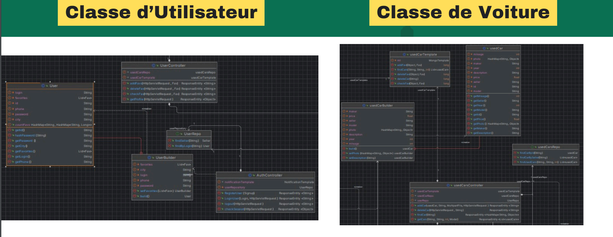
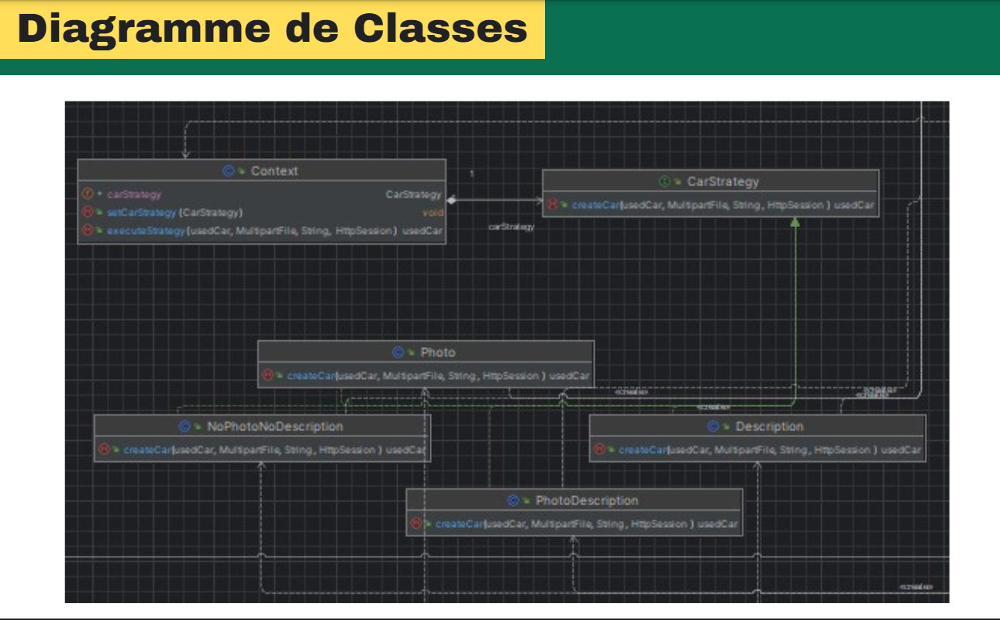
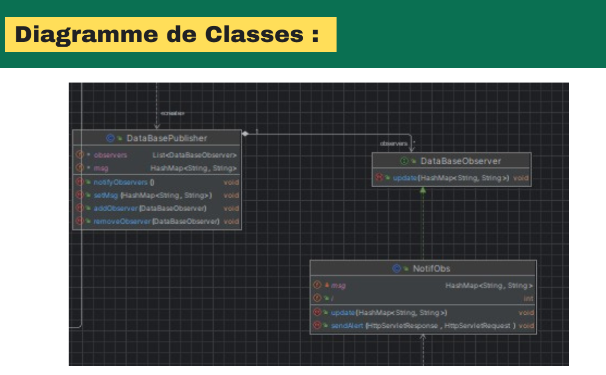
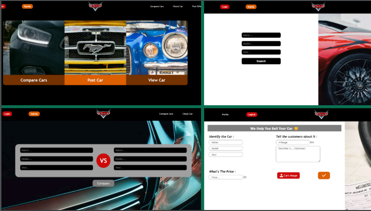
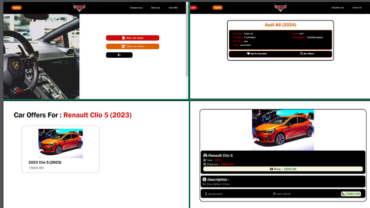
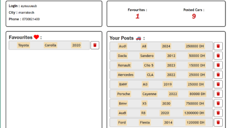
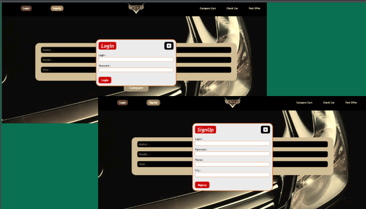
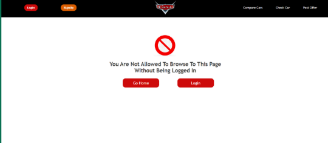

# Cars

Car Purchase Application with the functionalities :
- Login / Signup :lock:
- View Cars with Filter / View Single Car
- Add Offer :pencil2:
- Add Car To Favorites
- View Car Specs provided by an API

## Features

- Builder Design Pattern : 
Le Builder est un motif de conception de création qui vous
permet de construire des objets complexes étape par étape.
Ce motif vous permet de produire différents types et
représentations d'un objet en utilisant le même code de
construction.
    
- Strategy Design Pattern : 
 La Stratégie est un motif de conception comportemental qui
vous permet de définir une famille d'algorithmes, de placer
chacun d'eux dans une classe distincte et de rendre leurs
objets interchangeables 
[ utilisé pour l'organisation des fonctions d'ajout d'un offre de voiture selon les choix de l'utilisateur (avec/sans image || avec/sans description) ]
- Observer Design Pattern :
L'Observateur est un motif de conception comportemental
qui vous permet de définir un mécanisme d'abonnement
pour notifier plusieurs objets sur tout événement se
produisant sur l'objet qu'ils observent.
[utilisé pour ajouter une fonctionalite de notification en temps reel chaque fois un offre de voiture favoris par l'utilisateur est ajouté]

## Demo
- Builder Design Pattern

- Strategy Design Pattern

- Observer Design Pattern

- Take A Look :smiley:

## Acknowledgements

 - [Awesome Readme Templates](https://awesomeopensource.com/project/elangosundar/awesome-README-templates)
 - [Awesome README](https://github.com/matiassingers/awesome-readme)
 - [How to write a Good readme](https://bulldogjob.com/news/449-how-to-write-a-good-readme-for-your-github-project)

